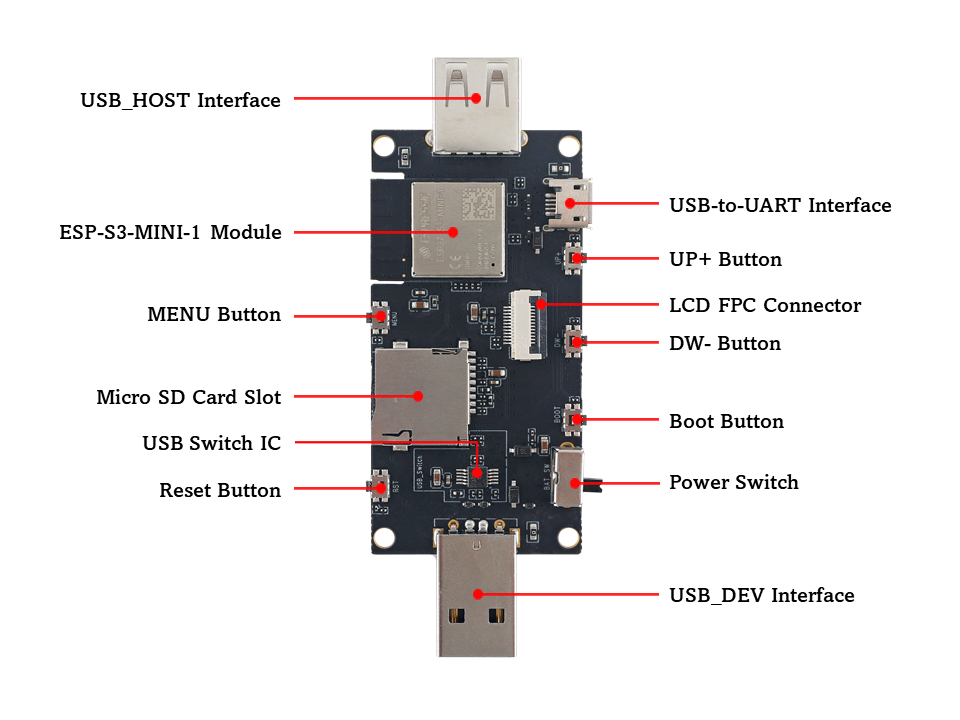

# BSP: ESP32-S3-USB-OTG

| [HW Reference](https://docs.espressif.com/projects/espressif-esp-dev-kits/en/latest/esp32s3/esp32-s3-usb-otg/user_guide.html) | [HOW TO USE API](API.md) | [EXAMPLES](#compatible-bsp-examples) |  |  |
| --- | --- | --- | --- | -- |

## Overview

<table>
<tr><td>

ESP32-S3-USB-OTG is a development board that focuses on USB-OTG function verification and application development. It is based on ESP32-S3 SoC, supports Wi-Fi and BLE 5.0 wireless functions, and supports USB host and USB device functions. It can be used to develop applications such as wireless storage devices, Wi-Fi network cards, LTE MiFi, multimedia devices, virtual keyboards and mice.

**The development board has the following features:**
* Onboard ESP32-S3-MINI-1-N8 module, with built-in 8 MB flash
* Onboard USB Type-A host and device interface, with built-in USB interface switching circuit
* Onboard USB to serial debugging chip (Micro USB interface)
* Onboard 1.3-inch LCD color screen, supports GUI
* Onboard SD card interface, compatible with SDIO and SPI interfaces
* Onboard charging IC, can be connected to lithium battery

</td><td width="200">
  
</td></tr>
</table>

## Capabilities and dependencies

<!-- START_DEPENDENCIES -->

|     Available    |       Capability       |Controller/Codec|                                           Component                                          |Version|
|------------------|------------------------|----------------|----------------------------------------------------------------------------------------------|-------|
|:heavy_check_mark:|     :pager: DISPLAY    |     st7789     |                                              idf                                             |>=5.1.3|
|:heavy_check_mark:|:black_circle: LVGL_PORT|                |[espressif/esp_lvgl_port](https://components.espressif.com/components/espressif/esp_lvgl_port)|   ^2  |
|        :x:       |    :point_up: TOUCH    |                |                                                                                              |       |
|:heavy_check_mark:| :radio_button: BUTTONS |                |       [espressif/button](https://components.espressif.com/components/espressif/button)       |   ^4  |
|        :x:       |  :musical_note: AUDIO  |                |                                                                                              |       |
|        :x:       | :speaker: AUDIO_SPEAKER|                |                                                                                              |       |
|        :x:       | :microphone: AUDIO_MIC |                |                                                                                              |       |
|:heavy_check_mark:|  :floppy_disk: SDCARD  |                |                                              idf                                             |>=5.1.3|
|        :x:       |    :video_game: IMU    |                |                                                                                              |       |
|:heavy_check_mark:|       :bulb: LED       |                |                                              idf                                             |>=5.1.3|
|:heavy_check_mark:|      :battery: BAT     |                |                                              idf                                             |>=5.1.3|

<!-- END_DEPENDENCIES -->

## Compatible BSP Examples

<!-- START_EXAMPLES -->

| Example | Description | Try with ESP Launchpad |
| ------- | ----------- | ---------------------- |
| [Display Example](https://github.com/espressif/esp-bsp/tree/master/examples/display) | Show an image on the screen with a simple startup animation (LVGL) | [Flash Example](https://espressif.github.io/esp-launchpad/?flashConfigURL=https://espressif.github.io/esp-bsp/config.toml&app=display) |
| [USB HID Example](https://github.com/espressif/esp-bsp/tree/master/examples/display_usb_hid) | USB HID demo (keyboard, mouse, or gamepad visualization using LVGL) | - |

<!-- END_EXAMPLES -->

<!-- START_BENCHMARK -->
<!-- END_BENCHMARK -->
